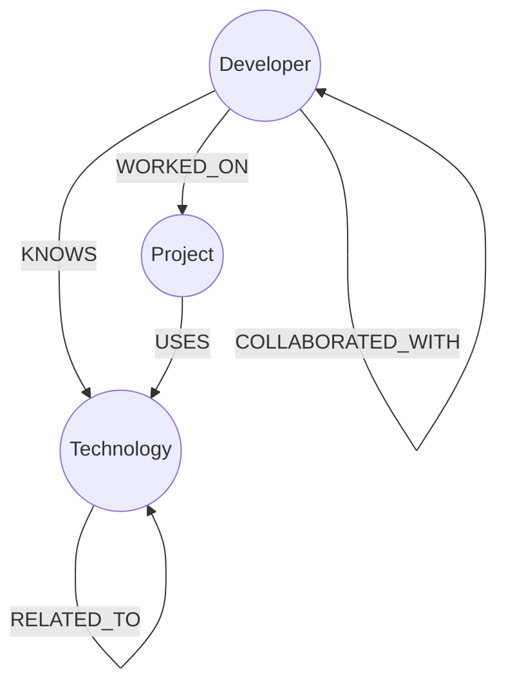

# DevGraph 🌐


**DevGraph** is a developer knowledge and collaboration graph designed to uncover the hidden connections between people, projects, and technologies. It demonstrates the power of graph databases for modeling complex, interconnected relationships in a developer ecosystem.

Unlike a traditional relational database dashboard, DevGraph focuses on **discovery and traversal**, enabling intuitive answers to relationship-centric questions like:
- *Who has worked together on a project?*
- *Who is a good candidate to learn a new technology based on what they already know?*
- *How are different technologies clustered around our projects?*
- *What is the network of collaborators around a particular developer?*


---

## 🧐 Why a Graph Database?

**The Problem with Relational Databases**

While a traditional SQL database could store this information using multiple join tables (e.g., `developer_technologies`, `project_developers`), querying complex relationships becomes increasingly awkward, slow, and hard to read. This is known as the "join explosion" problem.

**Example: A Simple Recommendation Question**
> *"Find developers who don't know React, but know a technology related to React, and suggest them as learners."*

**In SQL**: This requires multiple complex `JOIN`s, `EXISTS`, and `NOT IN` clauses, making the query hard to read and maintain:
```sql
SELECT DISTINCT d.* 
FROM developers d
WHERE NOT EXISTS (
  SELECT 1 FROM developer_technologies dt 
  WHERE dt.developer_id = d.id AND dt.technology_id = (
    SELECT id FROM technologies WHERE name = 'React'
  )
)
AND EXISTS (
  SELECT 1 FROM developer_technologies dt1
  JOIN technology_relationships tr ON dt1.technology_id = tr.tech_id1
  WHERE dt1.developer_id = d.id 
  AND tr.tech_id2 = (SELECT id FROM technologies WHERE name = 'React')
)
```

**In a Graph Database**: This is a natural, readable traversal path:
```cypher
Developer -> KNOWS -> Technology -> RELATED_TO -> React
```

Expressed in Cypher:
```cypher
MATCH (target:Technology {name: 'React'})
MATCH (d:Developer)-[:KNOWS]->(known:Technology)-[:RELATED_TO]-(target)
WHERE NOT (d)-[:KNOWS]->(target)
RETURN d, collect(known) as suggestedPath
```

**Why Graph Databases Excel:**
- ✅ **Intuitive Modeling**: Relationships are first-class citizens, not afterthoughts.
- ✅ **Natural Traversal**: Multi-hop queries read like English descriptions of the relationship path.
- ✅ **Performance**: Relationship traversal is O(1) regardless of graph size (no expensive joins across millions of rows).
- ✅ **Readability**: Queries are shorter and more maintainable.
- ✅ **Real-World Fit**: Developer networks, social graphs, recommendation engines, and knowledge bases naturally map to graph structures.

---

## ✨ Features

- **📊 Dashboard**: Real-time network statistics (developer count, projects, technologies, relationship count) fetched directly from the database.
- **👨‍💼 Developer Search & Profiles**: Find developers by name with dynamic profiles showing:
  - Technologies they know
  - Projects they've contributed to
  - Collaborators (automatically computed via 2-hop traversal)
  - Direct connections rendered in the graph
- **💼 Project Explorer**: Browse all projects and discover:
  - Teams that worked on each project
  - Technologies used in each project
  - Project status and launch year
- **💡 Technology Explorer**: Investigate technology adoption with:
  - Who knows each technology
  - Which projects use it
  - Related technologies and learning paths
  - **Intelligent Recommendation Engine**: Suggests developers to learn a technology based on related technologies they already know
- **🕸️ Interactive Graph Visualization**: Explore the entire network on a 2D physics-based canvas:
  - Drag and pan to explore
  - Click nodes to see details
  - Force-directed layout reveals natural clustering

---

## 🛠️ Technology Stack

| Category | Technology | Purpose |
|----------|-----------|---------|
| **Framework** | Next.js 16 | Modern React framework with App Router and API routes |
| **Database** | CognoDB / Neo4j | Graph database for relationship-centric queries |
| **Styling** | Tailwind CSS 4 | Utility-first CSS for responsive, modern UI |
| **Frontend** | React 19 | UI components and state management |
| **Graph Viz** | react-force-graph-2d | Interactive 2D force-directed graph visualization |
| **Icons** | Lucide React | Modern, consistent icon library |
| **Driver** | neo4j-driver 6.2 | Official Neo4j JavaScript driver |
| **Runtime** | TypeScript | Type-safe JavaScript with full IDE support |
| **Build** | tsx | TypeScript runtime for scripts |

---

## 🏗️ Architecture

```
cognodb-app/
├── app/                          # Next.js App Router
│   ├── api/                      # API Routes (Route Handlers)
│   │   ├── developers/           # Developer endpoints
│   │   ├── projects/             # Project endpoints
│   │   ├── technologies/         # Technology endpoints
│   │   ├── graph/                # Graph visualization endpoint
│   │   ├── recommendations/      # Recommendation engine
│   │   └── stats/                # Dashboard statistics
│   ├── developers/               # Developer pages (search, detail)
│   ├── projects/                 # Project pages
│   ├── technologies/             # Technology pages
│   ├── graph/                    # Graph explorer page
│   ├── layout.tsx                # Root layout
│   └── page.tsx                  # Dashboard/home page
├── components/
│   ├── layout/
│   │   └── Sidebar.tsx           # Navigation sidebar
│   └── ui/
│       ├── Loading.tsx           # Loading spinner
│       └── ErrorMessage.tsx      # Error state handler
├── lib/
│   ├── neo4j.ts                  # Neo4j driver singleton
│   └── queries/                  # Cypher query functions
│       ├── developers.ts         # Developer queries
│       ├── projects.ts           # Project queries
│       ├── technologies.ts       # Technology queries
│       ├── graph.ts              # Graph data queries
│       ├── stats.ts              # Statistics queries
│       ├── types.ts              # TypeScript interfaces
│       └── utils.ts              # Query utilities
├── public/                       # Static assets
└── scripts/
    └── seed.ts                   # Database seeding script
```

**Key Architectural Decisions:**

1. **Next.js App Router**: Modern, declarative routing with built-in server components.
2. **Secure Server-Side Access**: All Neo4j queries execute securely in `/api` route handlers. Database credentials are **never** exposed to the client browser.
3. **Separation of Concerns**: Database queries abstracted into `lib/queries/`, keeping UI components clean and focused on presentation.
4. **Graceful Error Handling**: Every page implements Loading, Empty, and Error states, gracefully degrading if the database becomes unavailable.
5. **Connection Pooling**: Single driver instance created once and reused across all queries (singleton pattern).

---

## 📊 Data Model

### Entity Relationship Diagram



### Graph Components

#### Node Types (3 total)

| Node Type | Description | Properties |
|-----------|-------------|-----------|
| **Developer** | Software engineer or team member | `id` (unique), `name`, `role`, `avatar` (URL), `location`, `bio` |
| **Project** | Development project or initiative | `id` (unique), `name`, `description`, `status` (Active/Completed), `year` |
| **Technology** | Programming language, framework, tool, or platform | `id` (unique), `name`, `category` (Language/Frontend/Backend/Database/etc) |

#### Relationship Types (5 total)

| Relationship | Direction | Purpose | Example |
|-------------|-----------|---------|---------|
| **KNOWS** | Developer → Technology | Developer has expertise in a technology | Alice KNOWS React |
| **WORKED_ON** | Developer → Project | Developer contributed to a project | Alice WORKED_ON GraphDB Dashboard |
| **COLLABORATED_WITH** | Developer ↔ Developer | Two developers worked on same project | Alice COLLABORATED_WITH Bob (via shared project) |
| **USES** | Project → Technology | Project uses a technology in its stack | GraphDB Dashboard USES Neo4j |
| **RELATED_TO** | Technology ↔ Technology | Technologies are related or complementary | React RELATED_TO Next.js |

#### Sample Graph Data

- **20 Developers** with diverse roles (Frontend, Backend, Full Stack, DevOps, Data Science, etc.)
- **12 Projects** spanning multiple years with varying status
- **20 Technologies** across different categories (Languages, Frameworks, Databases, DevOps, Cloud)
- **Dynamically Generated Relationships**:
  - Each developer knows 3-6 technologies
  - Each developer worked on 1-3 projects
  - Collaborations auto-generated from shared projects
  - Technology relationships manually curated (e.g., JavaScript ↔ TypeScript, React ↔ Next.js)

---

## 🔍 Core Cypher Queries Explained

### Query 1: Dashboard Statistics
**File**: `lib/queries/stats.ts`  
**Purpose**: Fetch aggregate data for the dashboard

```cypher
MATCH (d:Developer)
WITH count(d) AS developers
MATCH (p:Project)
WITH developers, count(p) AS projects
MATCH (t:Technology)
WITH developers, projects, count(t) AS technologies
MATCH ()-[r]->()
RETURN developers, projects, technologies, count(r) AS relationships
```

**Explanation:**
- Counts each node type independently
- Then counts all relationships
- Returns aggregate statistics for the dashboard widget

**Performance**: O(n) scan, but caches well; dashboard queries can even pre-compute this for read-heavy scenarios.

---

### Query 2: Developer Profile (Direct Connections)
**File**: `lib/queries/developers.ts`  
**Purpose**: Retrieve a single developer with all their immediate connections

```cypher
MATCH (d:Developer {id: $id})
OPTIONAL MATCH (d)-[:KNOWS]->(t:Technology)
OPTIONAL MATCH (d)-[:WORKED_ON]->(p:Project)
OPTIONAL MATCH (d)-[:COLLABORATED_WITH]-(c:Developer)
RETURN d, 
       collect(DISTINCT t) as technologies, 
       collect(DISTINCT p) as projects,
       collect(DISTINCT c) as collaborators
```

**Explanation:**
- `OPTIONAL MATCH` ensures we still return the developer even if they have no connections
- `collect(DISTINCT x)` aggregates multiple matches into a single list
- All connections are fetched in **one round trip** to the database

**Why It's Better Than SQL:**
- No complex JOINs required
- Easy to read intent: "Get this developer and all their relationships"
- Minimal data transfer (one query vs. multiple)

---

### Query 3: The Recommendation Engine (Multi-Hop Traversal)
**File**: `lib/queries/developers.ts`  
**Purpose**: Find developers who don't know a technology, but know a related one

```cypher
MATCH (target:Technology {name: $technologyName})
MATCH (d:Developer)-[:KNOWS]->(known:Technology)-[:RELATED_TO]-(target)
WHERE NOT (d)-[:KNOWS]->(target)
RETURN d as developer, collect(DISTINCT known) as knownTechnologies, target as targetTechnology
LIMIT 10
```

**Explanation:**
- **Line 1**: Find the target technology (e.g., "React")
- **Line 2**: Find developers who know a related technology to React (e.g., "JavaScript", "Next.js")
- **Line 3**: Exclude developers who already know React
- **Line 4**: Return developers, their bridging technologies, and the target
- **Line 5**: Limit to top 10 recommendations

**This is the "killer query" for graph databases:**
- **Multi-hop traversal**: Follows 2+ relationship hops naturally
- **Negative condition**: The `WHERE NOT` clause is trivial in Cypher vs. complex in SQL
- **Use Case**: Recommendation engines, skill gap analysis, learning path suggestions

---

### Query 4: Project Details with Team
**File**: `lib/queries/projects.ts`  
**Purpose**: Get a project and all developers + technologies involved

```cypher
MATCH (p:Project {id: $id})
OPTIONAL MATCH (d:Developer)-[:WORKED_ON]->(p)
OPTIONAL MATCH (p)-[:USES]->(t:Technology)
RETURN p, 
       collect(DISTINCT d) as developers, 
       collect(DISTINCT t) as technologies
```

**Explanation:**
- Returns the project and lists all developers and technologies associated with it
- Single query, efficient aggregation with `collect()`

---

### Query 5: Technology with Ecosystem
**File**: `lib/queries/technologies.ts`  
**Purpose**: Show a technology, who knows it, what uses it, and related technologies

```cypher
MATCH (t:Technology {id: $id})
OPTIONAL MATCH (d:Developer)-[:KNOWS]->(t)
OPTIONAL MATCH (p:Project)-[:USES]->(t)
OPTIONAL MATCH (t)-[:RELATED_TO]-(related:Technology)
RETURN t, 
       collect(DISTINCT d) as developers, 
       collect(DISTINCT p) as projects,
       collect(DISTINCT related) as relatedTechnologies
```

**Explanation:**
- Maps the complete ecosystem around a technology
- Shows adoption (who/what uses it) and the technology stack ecosystem (related techs)
- Natural for discovery UI (e.g., "If I learn React, I might also want to learn Next.js")

---

### Query 6: Graph Visualization Data
**File**: `lib/queries/graph.ts`  
**Purpose**: Fetch all nodes and edges for the interactive graph explorer

```cypher
MATCH (n)
WITH n LIMIT 150
OPTIONAL MATCH (n)-[r]->(m)
WHERE m IS NOT NULL
RETURN collect(DISTINCT n) as nodes, 
       collect(DISTINCT r) as relationships, 
       collect(DISTINCT m) as targetNodes
```

**Explanation:**
- `LIMIT 150`: Prevents overloading the browser with too many nodes
- Fetches all nodes, their outgoing relationships, and target nodes
- Client-side code then transforms into `{ nodes: [], links: [] }` format for force-graph
- Enables interactive exploration of the entire network

---

## 🚀 Getting Started

### Prerequisites
- **Node.js**: v18 or higher (check with `node --version`)
- **npm**: v9 or higher (included with Node.js)
- **CognoDB Instance**: Active database with credentials (see [CognoDB Setup](#cognodb-setup))

### 1. Clone the Repository
```bash
git clone https://github.com/yourusername/cognodb-app.git
cd cognodb-app
```

### 2. Install Dependencies
```bash
npm install
```

### 3. Create Environment Variables File

Create `.env.local` in the project root:
```env
# CognoDB Connection Credentials
COGNODB_URI=bolt+s://<your-db-id>.databases.cognodb.com
COGNODB_USERNAME=cognodb
COGNODB_PASSWORD=<your-secure-password>
```

**Where to find these:**
- Log into your CognoDB dashboard
- Navigate to your database instance
- Copy the connection string and credentials from the "Connect" section
- For local Neo4j instances, use `bolt://localhost:7687` or `neo4j://localhost:7687`

### 4. Seed the Database

The project includes a production-ready seed script using `MERGE` (idempotent—safe to run multiple times):

```bash
npm run seed
```

**Output:**
```
Starting seed process...
Seeding Technologies...
Seeding Developers...
Seeding Projects...
Creating Relationships: KNOWS...
Creating Relationships: WORKED_ON...
Creating Relationships: COLLABORATED_WITH...
Creating Relationships: USES (Projects use Technologies)...
Creating Relationships: RELATED_TO (Technologies related to each other)...
Seed completed successfully!
```

### 5. Start the Development Server
```bash
npm run dev
```

**Output:**
```
> cognodb-app@0.1.0 dev
> next dev

  ▲ Next.js 16.3.0
  - Local:        http://localhost:3000
  - Environments: .env.local

✓ Ready in 1.2s
```

Open your browser to **[http://localhost:3000](http://localhost:3000)** and explore the application!

### Troubleshooting

| Error | Solution |
|-------|----------|
| `Neo4j credentials not set` | Verify `.env.local` exists with correct credentials |
| `Connection refused` | Ensure your CognoDB instance is running and the URI is correct |
| `Empty dashboard` | Run `npm run seed` to populate the database |
| `Port 3000 already in use` | Use `npm run dev -- -p 3001` to use a different port |

---

## 🏠 CognoDB Setup

### Creating a CognoDB Instance

1. **Sign Up**: Visit [CognoDB Console](https://console.cognodb.com)
2. **Create Database**: Click "New Database" and select your region
3. **Configure**:
   - Database ID: `cognodb-demo` (or your choice)
   - Instance Type: Sandbox (free) or appropriate tier
   - Username: `cognodb` (default)
   - Password: Create a secure password
4. **Copy Connection String**: Format: `bolt+s://<db-id>.databases.cognodb.com`
5. **Test Connection**: Use Neo4j Desktop or command-line tools to verify connectivity

### Or: Local Neo4j Setup

For testing without CognoDB:

1. **Install Neo4j Desktop** from https://neo4j.com/download/
2. **Create Local Database**:
   - DBMS: Neo4j 4.4+ (Neo4j 5.x recommended)
   - Username: `neo4j`
   - Password: Set a password
3. **Start Database**: Click "Start" in Neo4j Desktop
4. **Update .env.local**:
   ```env
   COGNODB_URI=neo4j://localhost:7687
   COGNODB_USERNAME=neo4j
   COGNODB_PASSWORD=<your-password>
   ```

---

## ☁️ Deployment

### Vercel Deployment (Recommended)

Vercel is the optimal hosting platform for Next.js applications. It's free, fast, and automatically optimized.

**Step 1: Push to GitHub**
```bash
git remote add origin https://github.com/yourusername/cognodb-app.git
git push -u origin main
```

**Step 2: Connect to Vercel**
1. Go to [vercel.com](https://vercel.com)
2. Click "New Project"
3. Import your GitHub repository
4. Select the repository and click "Import"

**Step 3: Configure Environment Variables**
1. In Vercel dashboard, go to **Settings > Environment Variables**
2. Add three variables:
   - `COGNODB_URI`: Your database URI
   - `COGNODB_USERNAME`: Your database username
   - `COGNODB_PASSWORD`: Your database password
3. Click "Save"

**Step 4: Deploy**
- Click "Deploy"
- Vercel automatically builds and deploys
- Your application is live within 30-60 seconds!

**Access Your App:**
```
https://<your-project-name>.vercel.app
```

**Automatic Deployments:**
- Every push to `main` automatically redeploys
- Pull requests get preview deployments for testing

### Alternative: Railway, Render, or Fly.io

These platforms also support Next.js with free tiers:

**Railway.app** (Recommended for simplicity)
- Free tier: $5 credit/month
- Git integration: Automatic deployments
- Environment variables: Easy setup via dashboard

**Render.com** (Good uptime)
- Free tier: Sleeps after 15 min of inactivity
- Git integration: Automatic deployments
- Environment variables: Via dashboard

**Fly.io** (Best performance)
- Free tier: 3 shared-cpu-1x VMs
- Deploy via CLI: `flyctl deploy`
- Global edge deployment: CDN included

### Docker Deployment (Advanced)

```dockerfile
FROM node:18-alpine
WORKDIR /app

# Copy package files
COPY package*.json ./

# Install dependencies
RUN npm ci --only=production

# Copy source
COPY . .

# Build Next.js
RUN npm run build

# Expose port
EXPOSE 3000

# Start server
CMD ["npm", "start"]
```

Build and run:
```bash
docker build -t cognodb-app .
docker run -e COGNODB_URI=... -e COGNODB_USERNAME=... -e COGNODB_PASSWORD=... -p 3000:3000 cognodb-app
```

---

## 📸 UI Screenshots & Features

### Dashboard
- **Real-time Statistics**: Developer count, projects, technologies, and relationship metrics
- **Quick Navigation**: Links to all major sections
- **Network Overview**: At-a-glance view of the developer ecosystem

### Developer Search & Profiles
- **Search**: Find developers by name
- **Profile Card**: Shows role, location, bio, and avatar
- **Technologies Section**: All skills visualized as badges
- **Projects Section**: List of projects contributed to
- **Collaborators Section**: Dynamically computed co-workers

### Project Explorer
- **Project Listing**: Browse all active and completed projects
- **Project Details**: 
  - Description and status
  - Team members (all developers involved)
  - Tech stack (technologies used)
  - Launch year

### Technology Explorer
- **Technology Catalog**: Browse all technologies by category
- **Adoption Metrics**: Number of developers who know it, projects using it
- **Related Technologies**: Learning paths and ecosystem
- **Recommendation Engine**: Developers suggested to learn this technology

### Interactive Graph
- **Force-Directed Layout**: Nodes repel and attract based on connections
- **Draggable Nodes**: Pan and explore interactively
- **Color-Coded Nodes**:
  - Blue: Developers
  - Green: Projects
  - Purple: Technologies
- **Relationship Edges**: Shows all KNOWS, WORKED_ON, USES, RELATED_TO, and COLLABORATED_WITH connections
- **Real-Time Rendering**: Powered by `react-force-graph-2d`

*(Screenshots coming in deployment phase)*

---

## 📂 Project Structure

```
cognodb-app/
├── app/
│   ├── api/
│   │   ├── developers/
│   │   │   ├── route.ts              # GET /api/developers (search all)
│   │   │   └── [id]/route.ts         # GET /api/developers/:id (single developer)
│   │   ├── projects/
│   │   │   ├── route.ts              # GET /api/projects
│   │   │   └── [id]/route.ts         # GET /api/projects/:id
│   │   ├── technologies/
│   │   │   ├── route.ts              # GET /api/technologies
│   │   │   └── [id]/route.ts         # GET /api/technologies/:id
│   │   ├── graph/
│   │   │   └── route.ts              # GET /api/graph (all nodes/edges)
│   │   ├── recommendations/
│   │   │   └── route.ts              # POST /api/recommendations (suggest learners)
│   │   └── stats/
│   │       └── route.ts              # GET /api/stats (dashboard metrics)
│   ├── developers/
│   │   ├── page.tsx                  # Developer search page
│   │   └── [id]/page.tsx             # Developer detail page
│   ├── projects/
│   │   ├── page.tsx                  # Projects listing
│   │   └── [id]/page.tsx             # Project detail
│   ├── technologies/
│   │   ├── page.tsx                  # Technologies listing
│   │   └── [id]/page.tsx             # Technology detail
│   ├── graph/
│   │   └── page.tsx                  # Interactive graph explorer
│   ├── layout.tsx                    # Root layout (sidebar, navigation)
│   ├── page.tsx                      # Dashboard/home
│   └── globals.css                   # Global Tailwind styles
├── components/
│   ├── layout/
│   │   └── Sidebar.tsx               # Navigation sidebar
│   └── ui/
│       ├── ErrorMessage.tsx          # Error state component
│       └── Loading.tsx               # Loading spinner component
├── lib/
│   ├── neo4j.ts                      # Neo4j driver (singleton)
│   └── queries/
│       ├── developers.ts             # Developer queries
│       ├── projects.ts               # Project queries
│       ├── technologies.ts           # Technology queries
│       ├── graph.ts                  # Graph queries
│       ├── stats.ts                  # Statistics queries
│       ├── types.ts                  # TypeScript types
│       └── utils.ts                  # Utility functions
├── public/                           # Static files (images, icons)
├── scripts/
│   └── seed.ts                       # Database seeding script
├── .env.example                      # Environment template
├── .env.local                        # Environment variables (git-ignored)
├── next.config.ts                    # Next.js configuration
├── tsconfig.json                     # TypeScript configuration
├── tailwind.config.mjs               # Tailwind CSS configuration
├── postcss.config.mjs                # PostCSS configuration
├── package.json                      # Dependencies and scripts
├── eslint.config.mjs                 # ESLint configuration
└── README.md                         # This file!
```

---

## 🧪 Available Scripts

```bash
# Development
npm run dev              # Start dev server on http://localhost:3000

# Production
npm run build            # Build for production
npm start                # Start production server

# Database
npm run seed             # Seed database with sample data

# Quality
npm run lint             # Run ESLint
```

---

## 🔐 Security Considerations

1. **Environment Variables**: Store credentials in `.env.local` (git-ignored)
2. **Server-Side Queries**: All database access through `/api` route handlers
3. **No Client-Side Credentials**: The Neo4j driver is never exposed to the browser
4. **Connection Pooling**: Single driver instance prevents resource exhaustion
5. **Rate Limiting** (Optional): Consider adding rate limiting for production deployments
6. **HTTPS**: Always use HTTPS in production (Vercel provides this by default)

---

## 📚 Learning Resources

- **Neo4j/Cypher**:
  - [Cypher Query Language Docs](https://neo4j.com/docs/cypher-manual/)
  - [Graph Databases Book](https://graphdatabases.com/) (Free online)
  - [Neo4j Sandbox](https://sandbox.neo4j.com/) (Free practice environment)

- **Next.js**:
  - [Next.js Documentation](https://nextjs.org/docs)
  - [App Router Guide](https://nextjs.org/docs/app)
  - [API Routes](https://nextjs.org/docs/app/building-your-application/routing/route-handlers)

- **React**:
  - [React 19 Documentation](https://react.dev)
  - [Hooks Guide](https://react.dev/reference/react)

- **Graph Visualization**:
  - [force-graph Documentation](https://github.com/vasturiano/react-force-graph)

---

## 🎯 Next Steps / Future Enhancements

- [ ] Add full-text search for developers and projects
- [ ] Implement filtering and advanced queries
- [ ] Add user authentication and roles
- [ ] Create custom views and dashboards
- [ ] Export graph data to CSV/JSON
- [ ] Add data import tools
- [ ] Create REST API documentation (Swagger/OpenAPI)
- [ ] Performance optimization with query caching
- [ ] Integrate with GitHub API to auto-populate data
- [ ] Add machine learning recommendations

---

## 📖 License

This project is open source and available under the MIT License.

---

## 📧 Questions?

For support, feature requests, or bug reports, please open an issue on GitHub.

**Happy exploring! 🚀**
